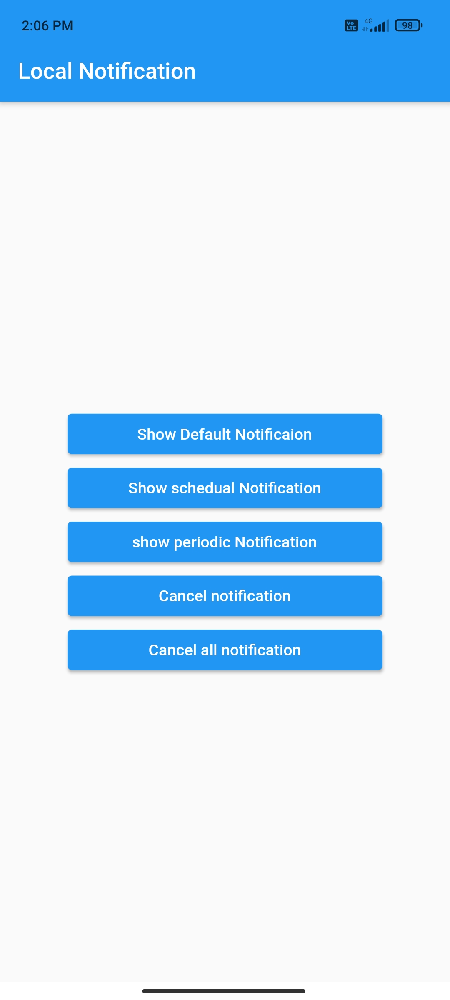
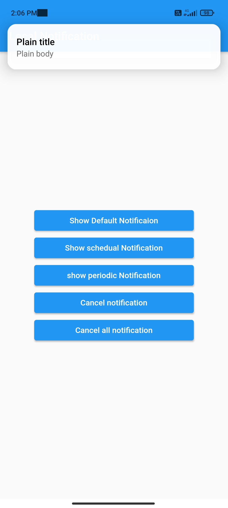

# Local Push Notification

A simple push notification app made with Flutter.

## 💻 Requirements

- Any Operating System (ie. MacOS X, Linux, Windows)
- Any IDE with Flutter SDK installed (ie. IntelliJ, Android Studio, VSCode etc)
- A little knowledge of Dart and Flutter

## ✨ Features

- [x] Local notification
- [x] Open app on notification click
- [x] Periodic notification
- [x] Schedual notification
- [x] Cancel notifications

## 📸 ScreenShots

| Light                            | Dark                             |
| -------------------------------- | -------------------------------- |
|  |  |

## 🔌 Plugins

| Name                                                                                     | Usage              |
| ---------------------------------------------------------------------------------------- | ------------------ |
| [**getx**](https://pub.dev/packages/get)                                                 | State Management   |
| [**flutter_local_notifications:**](https://pub.dev/packages/flutter_local_notifications) | Local Notification |

## 🤓 Author(s)

**Aakash Haribhau Kondhalkar**

## 🔖 LICENCE

[MIT](https://github.com/aakashkondhalkar/flutter_projects/blob/main/local_push_notification/LICENSE)
